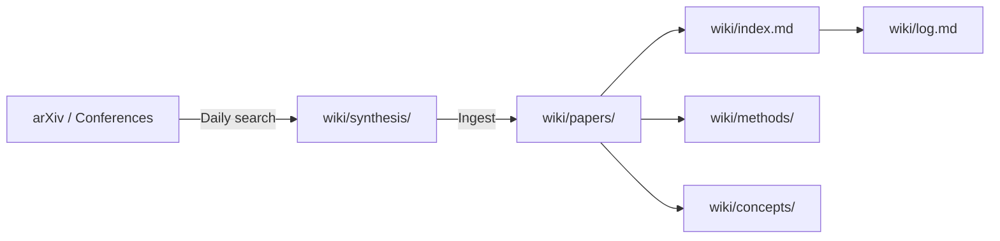

# karpathy-wiki

**English** · [简体中文](README.zh-CN.md)

> A dual-purpose research knowledge base: (1) a curated collection of **AI/LLM research papers** with daily arXiv tracking and conference coverage, and (2) a distilled biography of **Andrej Karpathy's** public thinking — X posts, talks, and source materials on neural networks, LLMs, and deep learning.

---

## Quick Paths

| I want to… | Start here |
|---|---|
| Browse latest papers by category | [wiki/index.md](wiki/index.md) (Papers section) |
| Read daily arXiv reports | [wiki/synthesis/](wiki/synthesis/) |
| See CTR Scaling landscape | [wiki/synthesis/ctr-scaling-landscape.md](wiki/synthesis/ctr-scaling-landscape.md) |
| Explore research by institution | [wiki/synthesis/affiliation-landscape.md](wiki/synthesis/affiliation-landscape.md) |
| Understand technical roadmap | [wiki/synthesis/technical-roadmap.md](wiki/synthesis/technical-roadmap.md) |
| Read Karpathy's worldview | [wiki/overview.md](wiki/overview.md) |
| Read in Obsidian | Open this directory as a vault |

---

## Research Coverage

### 8 Core Categories

| Category | Papers | Examples |
|----------|--------|----------|
| 🧠 **LLM Training & Theory** | 8 | Gated Attention, Self-Flow, Scaling Laws, MoE |
| 📊 **Recommendation Systems** | 13 | HSTU (Meta), Wukong, Kunlun, Netflix GenRec |
| 🎯 **CTR Prediction & Ranking** | 6 | FAT, RankUp (Tencent), SUAN (Meituan), GE4Rec |
| 🤖 **Agents & Multi-Agent** | 7 | MEM1, SkillOpt, Foundation Protocol |
| 🎮 **Games & Strategic RL** | 11 | ALIVE, SPIRAL, HGPO, PCSP |
| 🎨 **Generative Models & Diffusion** | 4 | ARCache, Precise (ByteDance), UniAR |
| 💻 **Code & Formal Reasoning** | 5 | CodeTree, Tree-of-Evolution, Agentic Proving |
| 🔄 **Sequence Modeling** | 2 | Preisach Attention, Dimensionality Barrier |
| 📐 **Benchmarking** | 1 | Benchmark Rigging Analysis |

**Total: 56 paper pages**, each with problem background, method details, key innovations, experimental comparison tables, and limitations.

### Conference Coverage

Papers ingested from: **ICML 2026** · **AAAI 2026** · **KDD 2026** · **SIGIR 2026** · **CVPR 2026** · **WWW 2026** · **NeurIPS 2025** · **ICLR 2026** · **ACL 2025** · **EMNLP 2025**

### Scheduled arXiv Daily

Daily arXiv search runs at **12:00 PM Beijing** (configurable via `opencode.json`), covering:
- LLM training & post-training
- Recommendation systems & CTR
- Agents & multi-agent systems
- Game AI & RL
- Code execution prediction
- Generative models & diffusion
- Sequence modeling & SSMs
- Evaluation benchmarks

---

## Repository Structure

| Path | Purpose |
|---|---|
| `raw/` | Immutable source documents (read-only) |
| `wiki/` | Wiki content (read-write, maintained by LLM) |
| `wiki/papers/` | 56 structured paper summaries with 5-part analysis |
| `wiki/synthesis/` | Cross-paper analyses: daily arXiv, conference digests, CTR landscape, affiliation landscape, technical roadmap |
| `wiki/concepts/` | 53 concept pages (Karpathy coinages + research concepts) |
| `wiki/entities/` | 46 entity pages (people, companies, products) |
| `wiki/methods/` | 7 method pages (algorithms & techniques) |
| `wiki/index.md` | Full content catalog — enter here |
| `wiki/log.md` | Append-only operation log |
| `wiki/overview.md` | Highest-compression synthesis of Karpathy's thinking |
| `.obsidian/` | Obsidian vault configuration |
| `.agents/` | LLM-wiki-bootstrap skill |
| `opencode.json` | OpenCode config with scheduler plugin |

### Workflow

---

## Setup

### Obsidian

1. Open this directory as a vault in Obsidian
2. Enable community plugins: **Dataview**, **Templater**, **obsidian-git**
3. Set attachments folder to `raw/assets/` in Settings → Files and links

### Scheduled Jobs

An OpenCode scheduler runs daily searches:

| Job | Time (Beijing) | Description |
|---|---|---|
| `arxiv-conference-daily` | 12:30 PM | arXiv + 9 大顶会最新论文 |
| `llm-tech-report-daily` | 1:00 PM | 大模型 Tech Report / System Card |
| `investment-daily` | 10:00 AM (工作日) | 美股/港股/A 股科技 AI 投资热点 |

To run immediately: `opencode run {job-name} now` (e.g. `arxiv-conference-daily`)

To list jobs: `opencode list-jobs`

---

## Key Synthesis Reports

| Report | Content |
|---|---|
| [ctr-scaling-landscape](wiki/synthesis/ctr-scaling-landscape.md) | 49 papers across 10 companies, 6 technical routes — the complete CTR/ranking scaling picture |
| [affiliation-landscape](wiki/synthesis/affiliation-landscape.md) | 10 institutions' research directions and evolution patterns |
| [technical-roadmap](wiki/synthesis/technical-roadmap.md) | 9 technical routes' development timeline and convergence signals |
| [conference-digest-2026-05-25](wiki/synthesis/conference-digest-2026-05-25.md) | 45+ papers from 9 top conferences with 5-part analysis |

### CTR Scaling: Key Findings

| Institution | Focus |
|---|---|
| **Meta** | Scaling law theory, HSTU (trillion-param), generative recommendation |
| **ByteDance** | TokenMixer family, co-scaling dense/sequence, live-streaming ranking |
| **Alibaba** | FAT (formal scaling law), generative pre-training, long-sequence MUSE |
| **Meituan** | Online CTR scaling methodology, sparse attention, MoE |
| **Tencent** | Generative CTR (GE4Rec), unified TokenFormer, rank collapse (RankUp) |
| **Kuaishou** | Unified scaling architecture, linear-complexity feature interaction |

---

## Statistics

| Layer | Count |
|---|---|
| Paper pages | 56 |
| Synthesis reports | 8 |
| Concept pages | 53 |
| Entity pages | 46 |
| Method pages | 7 |
| Source summaries | 31 |
| Total arXiv daily reports | 4 |
| Conferences covered | 10 |
| Total papers indexed | 121+ |

---

## How to Use

- **Browse papers** — Start at [wiki/index.md](wiki/index.md) and navigate by category
- **Read synthesis** — Open any report in [wiki/synthesis/](wiki/synthesis/) for cross-paper analysis
- **Daily updates** — The scheduled job fetches new papers each morning
- **Contribute** — Drop a PDF/URL into `raw/` and say "ingest {filename}" to create a paper page
- **Query** — Ask questions about the research landscape; the LLM routes through `wiki/index.md` first

---

> Scaffolded with [`llm-wiki-bootstrap`](https://github.com/nanzhipro/Karpathy-llm-wiki-bootstrap-skill). Remote: [btbujiangjun/karpathy-wiki](https://github.com/btbujiangjun/karpathy-wiki).
